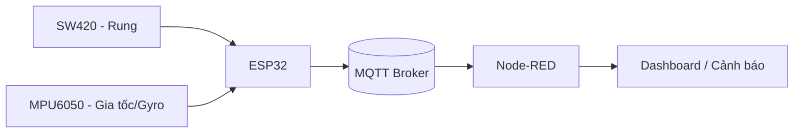

# HỆ THỐNG CHỐNG TRỘM XE MÁY ESP32 – MQTT – NODE-RED

## 1. Vấn đề thực tế
### 1.1. Nhu cầu thực tế

Tình trạng trộm cắp xe máy ở khu dân cư, chung cư, bãi xe ngày càng tinh vi. Một số hành vi thường gặp:
- Nâng xe để lấy trộm phụ tùng hoặc dắt xe đi.
- Nghiêng xe để phá khoá cổ, mở cốp hoặc lấy đồ.
- Tác động mạnh vào xe tại bãi gửi hoặc khu vực công cộng.
  
Các biện pháp chống trộm truyền thống như khóa cơ, còi, chuông đơn thuần không đủ thông minh để:

Vì vậy cần một giải pháp IoT thông minh:
- Phát hiện chính xác hành vi nghiêng, nâng xe.
- Gửi cảnh báo từ xa.
- Lưu lịch sử và điều khiển bằng điện thoại..

### 1.2. Lý do thực hiện
Dự án được thực hiện nhằm chế tạo một hệ thống chống trộm thông minh – giá rẻ – nhỏ gọn – hiệu quả, sử dụng:
- ESP32 – có WiFi, mạnh, giá thành thấp.
- MPU6050 – đo nghiêng, rung, chuyển động nâng xe
- SW-420 – phát hiện rung mạnh khi bị tác động.
- MQTT + Node-RED – gửi cảnh báo real-time và điều khiển từ xa.

  Hệ thống phù hợp cho:
  - Cá nhân lắp cho xe máy.
  - Bãi gửi xe nhỏ-to, hộ gia đình.
  - Mô hình học tập IoT.

## 2. Nội dung chính

### 2.1. Phần cứng sử dụng

| Thiết bị                          | Chức năng                                        |
|-----------------------------------|--------------------------------------------------|
| ESP32                             | Vi điều khiển trung tâm, kết nối WiFi & MQTT     |
| MPU6050 (Accel + Gyro)            | Phát hiện nghiêng, nâng, rung nhỏ                |
| SW-420                            | Phát hiện rung mạnh, tác động mạnh               |
| Buzzer                            | Phát âm báo động                                 |
| LED (trạng thái hệ thống)         | Báo trạng thái chống trộm ON/OFF                 |
| Nguồn USB/5V                      | Cấp nguồn cho ESP32                              |
#### Sơ đồ chân

| Thiết bị    | Chân   | ESP32 |
| ----------- | ------ | ----- |
| **MPU6050** | VCC    | 3.3V  |
|             | GND    | GND   |
|             | SCL    | 22    |
|             | SDA    | 21    |
| **SW420**   | VCC    | 3.3V  |
|             | GND    | GND   |
|             | DO     | 34    |
| **Buzzer**  |  +     | 25    |
|             |  -     | GND   |
| **LED**     |  +     | 13    |
|             |  -     | GND   |
#### Ảnh Fritzing


### 2.2. Phần mềm sử dụng
- PlatformIO (VSCode) – lập trình ESP32.
- MQTT Broker (MQTTX/EMQX) – trung gian truyền dữ liệu.
- Node-RED – xử lý dữ liệu, automation.
- Node-RED Dashboard – hiển thị:
    + Trạng thái chống trộm ON/OFF.
    + Accel X/Y/Z – Gyro X/Y/Z real-time.
    + Lịch sử cảnh báo.
- Gửi email cảnh báo qua Node-RED khi phát hiện nghiêng/rung bất thường.
  
### 2.3. Nguyên lý hoạt động
#### 2.3.1. Phát hiện nghiêng xe (Tilt detect)
ESP32 lấy dữ liệu từ MPU6050:

- Gia tốc: X/Y/Z (m/s² hoặc G)
- Gyro: X/Y/Z (°/s)
  
Ngưỡng cơ bản (tuỳ chỉnh):
- TiltThreshold ≈ 0.7G → xe bị nghiêng mạnh trái/phải.
- LiftThreshold ≈ 0.6G → xe bị nâng bánh lên.
  
Khi vượt ngưỡng:

→ ESP32 kích hoạt báo động.

→ Gửi MQTT đến Node-RED Dashboard.
#### 2.3.2. Kích hoạt báo động
Điều kiện báo động:
- Nghiêng xe vượt tilt threshold.
- Bị nâng lên.
- Rung mạnh (SW-420 hoặc Gyro tăng đột ngột).
Khi báo động:
- Buzzer: **Bip 150ms ON / 150ms OFF**.
- LED nháy nhanh.
- MQTT publish:
  {"alarm": "ON"}
- Node-RED gửi email nếu bật tính năng, 10s 1 lần nếu có cảnh báo.
  
- Hệ thống tự tắt báo động sau 120s nếu không reset.
#### 2.3.3. Điều khiển từ xa (MQTT control)
##### Bật chống trộm
**Topic:**

esp32/alarm/control

**Payload:**
```json
{"enable": true}
```
##### Tắt chống trộm
**Topic:**

esp32/alarm/control

**Payload:**
```json
{"enable": false}
```
**Topic dữ liệu ESP32 gửi lên**

esp32/alarm/data
```json
{
  "vibration": "LOW",
  "tilt": "NO",
  "lift": "NO",
  "alarm": "OFF",
  "acc": {"x":0.12,"y":-0.03,"z":0.98},
  "gyro": {"x":-1.1,"y":0.5,"z":1.3}
}

```

## 3. Sơ đồ khối
```
Baitapcuoiky
├── include
│   └── ca_cert_emqx.h
├── lib
│   ├── alarm
│   │   ├── alarm.cpp
│   │   └── alarm.h
│   ├── mqtt_client
│   │   ├── mqtt_client.cpp
│   │   └── mqtt_client.h
│   ├── sensor_sw420
│   │   ├── sensor_sw420.cpp
│   │   └── sensor_sw420.h
│   └── sensor_mpu6050
│       ├── sensor_mpu6050.cpp
│       └── sensor_mpu6050.h
├── src
│   └── main.cpp
```
### Giải thích cấu trúc thư mục

| Thư mục / File        | Chức năng                                       |
|-----------------------|-------------------------------------------------|
| `include/`            | Chứa file chứng chỉ MQTT                        |
| `lib/alarm/`          | Xử lý bật/tắt báo động, điều khiển buzzer/LED.  |
| `lib/mqtt_client/`    | Kết nối MQTT, publish/subscribe.                |
| `lib/sensor_sw420/`   | Xử lý đọc cảm biến rung SW420.                  |
| `lib/sensor_mpu6050/` | Xử lý đọc cảm biến MPU6050.                     |
| `src/main.cpp`        | Chương trình chính của ESP32.                   |



## 4. Kết quả
### 4.1. Ảnh mô hình


### 4.2. Giao diện tổng quan Dashboard
Dashboard gồm các thành phần chính:
- Card hiển thị trạng thái rung (Vibration): **LOW, MEDIUM, HIGH**
- Card hiển thị trạng thái nghiêng (Tilt): **YES, NO**
- Card hiển thị trạng thái của Led+Coi (Alarm):  **ON,OFF**
- Card hiển thị trạng thái nâng lên (Lift): **YES, NO**
- Công tắc điều khiển từ xa → bật/tắt hệ thống chống trộm (enable): **ON,OFF**
- Card hiển thị MPU6050 (acc, gyro) ví dụ: 
    + acc:
        + Accel X:  0.12 g
        + Accel Y: -0.03 g
        + Accel Z:  0.98 g
    + Gyro:
        + Gyro X: -1.23 deg/s
        + Gyro Y:  0.52 deg/s
        + Gyro Z:  1.88 deg/s


### 4.3. Lưu đồ dữ liệu Dashboard'


Dashboard tiếp nhận dữ liệu từ:
- esp32/sensor/data

Dashboard gửi lệnh xuống ESP32 qua:
- esp32/alarm/control -> {"enable": true/false}
### 4.4. Ảnh Dashboard
**Tắt chống trộm**


**Bật chống trôm**


- Hệ thống tự tắt báo động sau 120s nếu không reset.
**Email**
- Khi có bộ thực thì còi+Led **ON** gửi cảnh báo về email 10s 1 lần.
- Khi có bộ thực thì còi+Led **OFF** không gửi cảnh báo về email.
  
## Video demo
